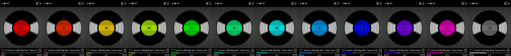

# xDuoo X3II SinuX Edition firmware

# Features

* English and Russian languages improvements
* Brand new UI design
* UI speed-up
* Changeable UI themes (12 built in + unlimited amount can be loaded from SD card)
* Battery levels fixed
* Brightness levels fixed
* All five DAC digital filters implemented (Sharp/Slow/Short Delay/Short Delay Slow/Super Slow Roll-off)
* EQ adjust range extended to ±9dB
* DSD noise fixed
* Track count limit increased from 15k to 65k
* SBC XQ feature implemented ([see this article](http://soundexpert.org/articles/-/blogs/audio-quality-of-sbc-xq-bluetooth-audio-codec))
* Two-way AAC (Tx: AAC-LC, CBR 256kbps, 20kHz bandwidth; Rx: controlled by source)
* Two-way LDAC (Tx: LDAC HQ 909/990kbps, Rx: controlled by source)
* LCD color gamma fixed
* New splash screen
* Native sampling rate support up to 384kHz

# Installation guide

Just place [update.upt](update.upt) file on the root of SD card and launch `Firmware update` in system settings.
If you want a larger font, use the [bigger_font_update.upt](bigger_font_update.upt) file (don't forget to rename it to `update.upt` first).
If you have any trouble with bluetooth connection - just disable LDAC & SBC XQ in bluetooth settings and restart your player.

**Attention:** this eXtreme version overrides bluetooth mac address with `42:54:30:00:00:00`! To prevent this, disassemble firmware using ThemeTool and replace this address by yours in the end of `autoupdate/logo.bin` file.

**Attention to Rockbox users:** you must go back to the stock 1.2 firmware first!

# Ways to support me

If you liked my firmware, feel free to say "Thank you" :blush:

|PayPal|Yandex.Money|
|:-----------------------:|:-----------------------:|
|||