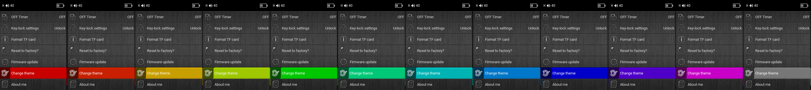

# xDuoo X3II SinuX Edition firmware

# Features

* English and Russian languages improvements
* Brand new UI design
* UI speed-up
* Changeable UI themes (12 built in + unlimited amount can be loaded from SD card)
* Battery levels fixed
* Brightness levels fixed
* All five DAC digital filters implemented (Sharp/Slow/Short Delay/Short Delay Slow/Super Slow Roll-off)
* EQ adjust range extended to ±9dB
* DSD noise fixed
* SBC bluetooth codec overclocked to more than 600+ kbps

# Installation guide

Just place `update.upt` file on the root of SD card and launch `Firmware update` in system settings.
If you want a larger font, use the `bigger_font_update.upt` file (don't forget to rename it to `update.upt` first).

**Attention to Rockbox users:** you must go back to the stock 1.2 firmware first!

# Ways to support me

If you liked my firmware, feel free to say "Thank you" :blush:

|PayPal|Yandex.Money|
|:-----------------------:|:-----------------------:|
|||